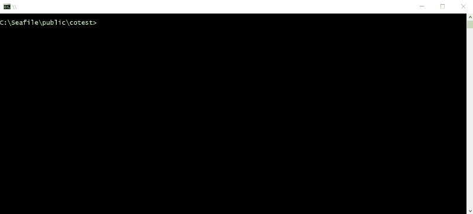

<!-- markdownlint-disable MD004 MD007 MD010 MD041 MD022 MD024 MD032 -->
# cotest

*yet another unit test assertion and test runner* -
***small, simple, no dependencies***



• [Why](#why) • [What](#what) • [How](#how) • [License](#license) •

# Why

This originated as an attempt to have assertions that are less verbose because `assert.notDeepStrictEqual` is ugly.
(just try in other languages to get that first time feel once again: `verifier.nonEgaliteRecursiveStricte`)

Package [tt](https://www.npmjs.com/package/tt) was used as a start and was modified considerably to change the API.

# What

## Features

* Javascript Comparison Operators (`==`, `!==`, `===`, `!===`, `<`, `<=`, `>`, `>=`)
* Other symbols for nested object
	* `{==}`: deepEqual
	* `!{==}`: notDeepEqual
	* `{===}`: strictDeepEqual
	* `!{===}`: notStrictDeepEqual
* Async support
* Basic test runner to run multiple files and directories
* Single function, no methods, nothing to learn, nothing to remember
* Basic coloring of errors
* Compact reporting
* Support only running selected tests for troubleshooting
* No dependencies, under 100 SLOC

## Limitations

* Node only (not for browsers)
* No nesting of tests
* Limited configuration

# How

## Installation

In node, from the project root folder type `npm i -D cotest` to install.

## API

command line: `cotest file1 directory1 directory2 file2 ...`

test declaration: `cotest(titleString, testFunction [, priority[, message]])`

assertion inside a test: `cotest(operator, valueToTest, referenceValue[, additional message])`

### Async use

Test are normally automatically completed after the test function is executed.
Example: `cotest('syncTest', function() { /*assertions*/ })`

To change this behaviour, add a callback to the test function. This calback must be called to end the test.
Example: `cotest('asyncTest', function(done) { /*assertions*/; done()})`

If a callback is declared but not called, the test fails after 250ms.
To change the default duration: `cotest.timeout(500)`


## Use in a test file

```javascript
	var co = require('cotest')
	co('async test, call the function argument to end' function(done) {
		co('<', Math.abs(error), 0.001)
		setTimeout(done, 0)
	})
	co('sync test - no function argument needed' function() {
		co('==', 1+1, 2)
		co('{==}', [1, 2], [1, 2])
	}, 'Any Truthy Value as 3rd argument will only run flagges tests')
	co('sync test - no function argument needed' function() {
		co('==', 1+1, 2)
		co('{==}', [1, 2], [1, 2])
	})
```

## Use in `package.json`

```json
"scripts": {
	"test": "cotest mytestdirectory",
	"test_file": "cotest mytestdirectory/mytestfile"
}
```

In any of the test files are flagged as priority, only these tests will run.

# License

Released under the [MIT License](http://www.opensource.org/licenses/MIT)
